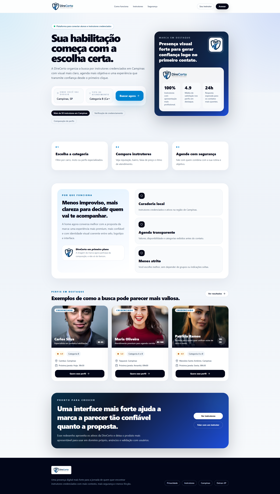

# DireCerto

Landing page em React para divulgação e busca de instrutores credenciados, com identidade visual própria, filtros por categoria e preparação para deploy estático.



## Visão Geral

O projeto foi desenvolvido para apresentar a marca DireCerto com uma interface mais forte, mais comercial e mais clara para o usuário final.

Hoje a aplicação inclui:

- home com foco em conversão
- identidade visual com as artes `DireCerto.png` e `DireCerto2.png`
- filtro por categoria:
  - `Categoria A`
  - `Categoria B`
  - `Categoria A e B`
  - `Atendimento PCD`
- filtro por localização digitada
- separação entre perfis em destaque e perfis comuns
- tela de resultados baseada nos filtros selecionados

## Stack

- `React 19`
- `TypeScript`
- `Vite`
- `Tailwind CSS 4`

## Estrutura

Principais arquivos:

- [src/App.tsx](C:/Users/User/Documents/vs/DireCerto/src/App.tsx): interface principal, dados fictícios, filtros e navegação entre home e resultados
- [src/index.css](C:/Users/User/Documents/vs/DireCerto/src/index.css): estilos globais e ajustes finos
- [index.html](C:/Users/User/Documents/vs/DireCerto/index.html): shell HTML e favicon
- [public/DireCerto.png](C:/Users/User/Documents/vs/DireCerto/public/DireCerto.png): marca/selo
- [public/DireCerto2.png](C:/Users/User/Documents/vs/DireCerto/public/DireCerto2.png): logotipo horizontal

## Como Rodar

Instale as dependências:

```bash
npm install
```

Inicie o ambiente local:

```bash
npm run dev
```

Abra no navegador:

```text
http://localhost:5173
```

## Build

Gerar versão de produção:

```bash
npm run build
```

Visualizar o build localmente:

```bash
npm run preview
```

Os arquivos finais serão gerados em:

```text
dist/
```

## Deploy

Como o projeto é estático, o deploy pode ser feito em qualquer hospedagem que sirva HTML/CSS/JS.

### Hostinger

Fluxo recomendado:

1. Rode `npm run build`
2. Abra a pasta `dist`
3. Envie o conteúdo de `dist` para `public_html`

Importante:

- envie os arquivos de dentro de `dist`, não a pasta `dist` como subpasta
- `index.html` precisa ficar na raiz de `public_html`
- a pasta `assets` precisa ir junto
- os arquivos de marca exportados também precisam estar lá, como `DireCerto.png` e `DireCerto2.png`, se estiverem presentes no build

Estrutura esperada no servidor:

```text
public_html/index.html
public_html/assets/...
public_html/DireCerto.png
public_html/DireCerto2.png
```

## Filtros

Atualmente a busca considera:

- categoria selecionada
- localização digitada

Regras:

- `Categoria A`: mostra quem atende `A`
- `Categoria B`: mostra quem atende `B`
- `Categoria A e B`: mostra apenas quem atende as duas categorias
- `Atendimento PCD`: mostra perfis com atendimento `PCD`
- localização: filtra por texto presente no campo de região/bairro

## Destaques

Nem todos os professores são destaque.

O projeto usa uma separação entre:

- perfis `featured`
- perfis comuns

Na home:

- a seção de destaque mostra primeiro os perfis marcados como destaque
- se o filtro atual não encontrar destaques, a interface usa perfis comuns como fallback

Na tela de resultados:

- todos os perfis filtrados são exibidos
- o selo `Destaque` aparece apenas nos perfis destacados

## Dados

Os instrutores atuais são fictícios e estão definidos diretamente em [src/App.tsx](C:/Users/User/Documents/vs/DireCerto/src/App.tsx).

Cada perfil possui campos como:

- `name`
- `rating`
- `price`
- `categories`
- `categoryLabel`
- `region`
- `availability`
- `highlight`
- `featured`

## Personalização Rápida

Se quiser adaptar o projeto rapidamente, os pontos mais comuns são:

1. trocar os textos da home em [src/App.tsx](C:/Users/User/Documents/vs/DireCerto/src/App.tsx)
2. substituir os perfis fictícios por dados reais
3. ajustar o favicon em [index.html](C:/Users/User/Documents/vs/DireCerto/index.html)
4. trocar as imagens da marca em `public/`

## Scripts

```bash
npm run dev
npm run build
npm run preview
npm run lint
```

## Status

Projeto pronto para:

- apresentação visual
- deploy estático
- validação de layout
- evolução futura para busca real com backend
